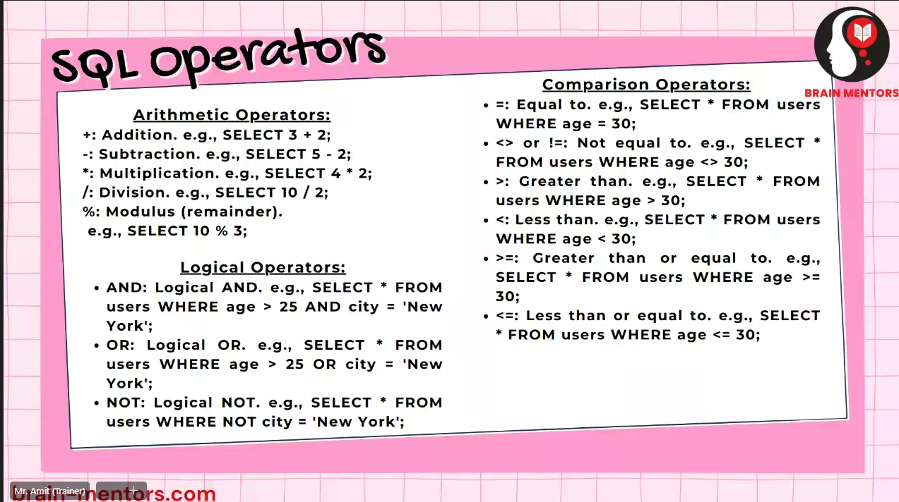

# How to connect to Mysql

We use the command after setting the Path variable as follows:

```mysql
mysql -u username -p{There should be no space between}password
```

> After the MySQL shell gets activated we can perform various operations.

## Creation of Database

- The Command to see the databases present in the system

```mysql
show databases;
``` 

- To select the Database

```mysql
use database_name;
``` 

- To Create Database

```mysql
create database database_name;
``` 

- To Create a Table

```mysql
create table table_name ( 
    column1 datatype attribute,
    column2 datatype,
);
```
- To drop database

```mysql
drop database database_name;
```

- To Insert data into the table

    - This mehtod is mostly used when the table has multiple columns.
```mysql
insert into table_name (column1, a, column2 b) values (a, b);
```

```mysql
insert into table_name values (a, b, c);
```
- `It has to be in Order and Number of Columns should be same`

- To delete data from the table

```mysql
delete from table_name where column_name = value;
```

- To update data in the table

```mysql
update table_name set column_name = value where column_name = value;
```

- Alter table

```mysql
alter table table_name add column_name datatype;
```

- Alter Exisitng Column

```mysql
alter table table_name modify column_name datatype;
```

- Drop table

```mysql
drop table table_name;
```

- Truncate table

```mysql
truncate table table_name where column_name = value;
```

******
### Types of Commands ->

- DDL (Data Definition Language) -> Create, A database, Create a table, Alter a table, Drop a table, Drop a database, truncate
- DML (Data Manipulation Language) -> Insert, Update, Delete
- DQL (Data Query Language) -> Select. Join, Aggregate
- TCL (Transaction Control Language) -> Commit, Rollback, Savepoint
- DCL (Data Control Language) -> Grant, Revoke


******

### Types of Datatypes ->


******

### Types of Operators ->



******

> We can perform mathematical equations in MySQL shell\
```mysql
select 10 + 5;
```

> All of the example commands are present in [Queries List](DBMS\Queries_sql.sql)

******

### Different Types of Constraints


