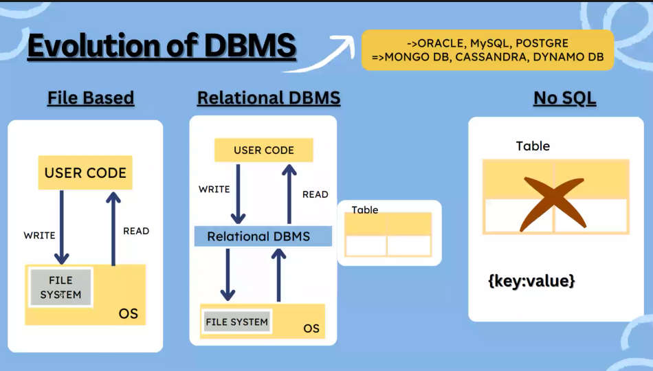

# Introduction to DBMS

******

`Data` are the facts and information in the raw form.

The Data can be stored in the following application ->
- Excel
- MS Acess
- Mongo DB
- SQL
- Files and Folder
- Text File

`Query` is a way of writing the command to interact with the Data. It is written in Structured Query Language format.

`Relational Database` has multiple interlinked tables, that relate to each other on some column.

`Database Management System` is a collection of Software that provides a quick way to acess and modify data.

`Importance of DBMS ->`
1. Data Organization and Management
2. Data Integrity and Accuracy
3. Efficient Data Retrieval
4. Scalability and Felxibility
5. Concurrent Acess
6. Enhanced Decision - Making
7. Data Abstraction and Independence

`Document Object Model ->` How the data is stored in the form of HTML.

`Other Types of Database ->`

`RDBMS v/s DBMS ->`

`Schema ->` The blueprint or structure of a database, how data is organized into tables, fields, and relationships.
- Flexibility
- Data Integrity
- Logical Structure

`Instance ->` The actual data stored in the database at a particular moment in time, conforming to the database schema.
- Dynamic Data
- Transactions
- Scalability

`Components of Database ->`
