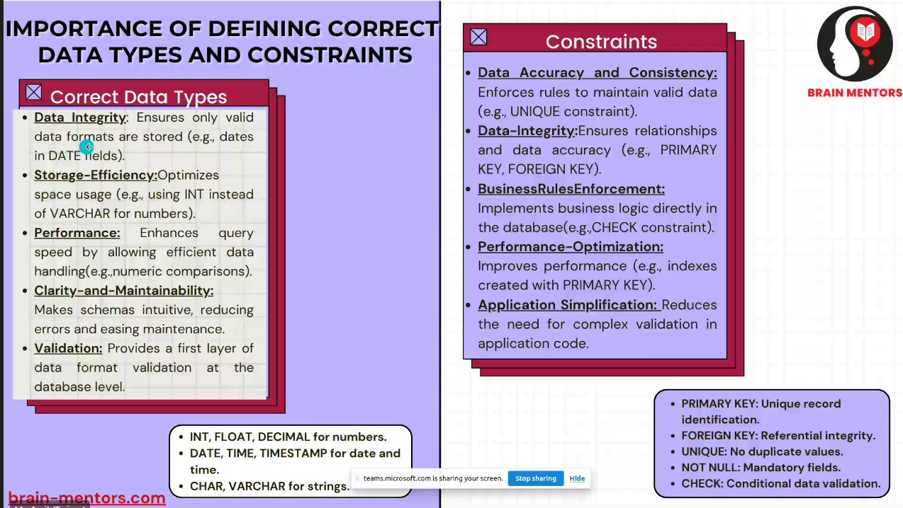

# Queries of MySQL

> This is the Continuation of [Introduction to MySQL](IntroToMySQL.md)

## Data Constraints in MySQL



## Add Column to a Table

```mysql
alter table table_name add column_name datatype;
```

## Drop Column from a Table

```mysql
alter table table_name drop column_name;
```

## Add Foriegn Key constraint to a Table

```mysql
alter table table_name
add constraint_name
foreign key(column_name)
references table_name(column_name);
```

## Types of Keys in MySQL

* Primary Key
* Unique Key
* Foreign Key
* Check Key

### Primary Key

Primary key is used to uniquely identify each row of a table.

```mysql
create table table_name
(
    column_name datatype primary key
);
```

### Unique Key

Unique key is used to ensure that no two rows of a table have the same values in the column.

```mysql
create table table_name
(
    column_name datatype unique key
);
```

### Foreign Key

Foreign key is used to establish a relationship between two tables.

```mysql
create table table_name
(
    column_name datatype foreign key
    references table_name(column_name);
);
```

### Check Key

Check key is used to ensure that the value of a column meets certain conditions.

```mysql
create table table_name
(
    column_name datatype check condition
);
```

## Agregate Functions

Aggregate functions are used to perform mathematical operations on a set of values.

```mysql
select avg(column_name) from table_name;
select count(column_name) from table_name;
select max(column_name) from table_name;
select min(column_name) from table_name;
select sum(column_name) from table_name;
```

## Renaming the Column name in Select

```mysql
select column_name as new_column_name from table_name;
```

## Renaming the Table name in Select

```mysql
select column_name from table_name as new_table_name;
```

### Substring Selection

```mysql
select substring(column_name, start, length) from table_name;
```